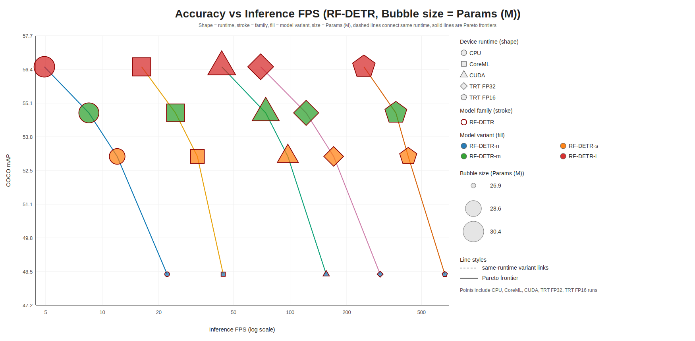
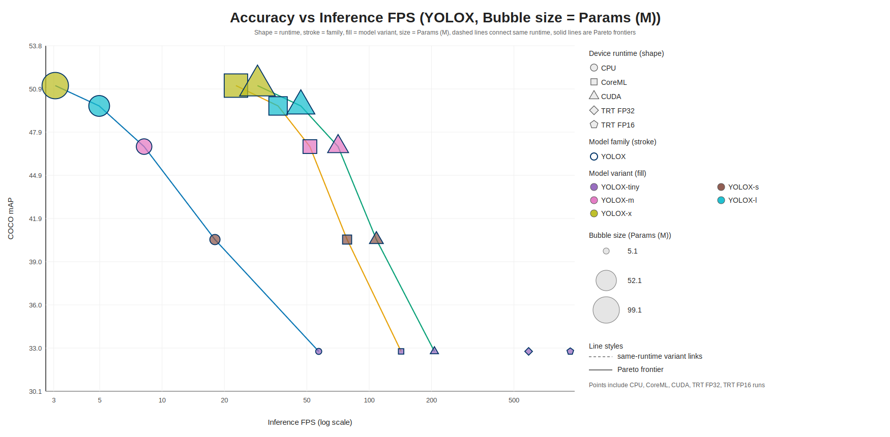

# OpenDetect


Open-source object detection for Python developers. Frictionless installation. Free for commercial use.

`opendetect` packages high-quality ONNX object detection models behind one consistent API, with both Python and CLI workflows.

## Why OpenDetect

- Consistent API across multiple model families
- ONNX Runtime inference with automatic provider selection
- OpenCV/NumPy-first I/O and preprocessing
- Built-in model registry, auto-download and caching support
- Ready-to-use CLI for inference and benchmarking

## Installation

```bash
pip install opendetect
```

For explicit runtime selection:

```bash
# CPU runtime (explicit)
pip install "opendetect[cpu]"

# CUDA runtime
pip install "opendetect[gpu]"
```

Core runtime dependencies are:

- `onnx`
- `onnxruntime`
- `opencv-python`
- `numpy`

## Quickstart (Python)

```python
import cv2
from opendetect import Detector

# model can be a registry model-id (recommended) or backend name
# examples: rfdetr-m, rfdetr-l, yolox-s, yolox-m

detector = Detector(model="rfdetr-m")

image = cv2.imread("input.jpg")
detections = detector.predict(image, color="bgr")
annotated = detector.annotate(image, detections, color="bgr")

cv2.imwrite("output.jpg", annotated)
```

Run file-based inference directly:

```python
from opendetect import Detector

detector = Detector(model="yolox-s")
detector.infer_image_file("input.jpg", output_path="output.jpg")
detector.infer_video_file("input.mp4", output_path="output.mp4", max_frames=300)
```

Class IDs are normalized across models:

- `0`-based foreground class IDs by default
- RF-DETR background index `0` is ignored internally
- If `--classes` (or `class_ids`) is omitted, all foreground classes are kept

## Model Registry

OpenDetect includes an internal model registry with metadata per model:

- implementation family (`rfdetr` / `yolox`)
- default input size
- artifact path and remote URL

Included model families:

| Family | Year | License posture | Why included |
| --- | ---: | --- | --- |
| `RF-DETR` | 2026 | Open-source, permissive for commercial use | Strong accuracy/speed tradeoff in modern detector architecture. |
| `YOLOX` | 2021 | Apache-2.0 (commercial-friendly) | Mature baseline with broad ecosystem familiarity and stable deployment behavior. |

List models:

```python
from opendetect import list_models

for spec in list_models():
    print(spec.model_id, spec.input_size)
```

Inspect/download from CLI:

```bash
opendetect-models list
opendetect-models info rfdetr-m
opendetect-models download rfdetr-m
```

By default models are cached under `~/.cache/opendetect/checkpoints`.
Set `OPENDETECT_CACHE_DIR` to override.

## CLI

### Inference

```bash
opendetect --version
opendetect-infer --image data/images/crowd.png --model-id rfdetr-m --output output.png
opendetect-infer --video input.mp4 --model-id yolox-s --tensor-rt --output output.mp4
# list supported classes for a model
opendetect-infer --model-id yolox-s --list-classes
# filter by class names instead of IDs
opendetect-infer --image data/images/crowd.png --model-id yolox-s --class-names person,bicycle
```

### Benchmark

```bash
opendetect-benchmark --model-id rfdetr-l --mode dummy --warmup 20 --iterations 200 --tensor-rt --mixed-precision  # RF-DETR benchmark with synthetic frames on TensorRT FP16
opendetect-benchmark --model-id yolox-m --mode video --video input.mp4 --max-frames 500 --no-hardware-acceleration  # YOLOX benchmark with real video frames on CPU runtime
```

Supported benchmark modes:

- `--mode dummy`: synthetic frames for controlled throughput measurement.
- `--mode video`: real video decode + preprocess + inference + postprocess timing.

`x = infer FPS (log scale)`, `y = COCO mAP`, shape = runtime, stroke color = model family, fill color = model variant, bubble size = model complexity, dashed lines connect same-runtime variants, solid lines are runtime Pareto frontiers.

#### RF-DETR



| Model | Params (M) | FLOPs (G) | COCO mAP |
| --- | ---: | ---: | ---: |
| RF-DETR-n | 26.877 | 31.787 | 48.4 |
| RF-DETR-s | 28.524 | 59.560 | 53.0 |
| RF-DETR-m | 30.101 | 78.492 | 54.7 |
| RF-DETR-l | 30.350 | 125.234 | 56.5 |

| Model | CPU (Pipeline/Infer) | CoreML (Pipeline/Infer) | CUDA (Pipeline/Infer) | TRT FP32 (Pipeline/Infer) | TRT FP16 (Pipeline/Infer) |
| --- | ---: | ---: | ---: | ---: | ---: |
| RF-DETR-n | 20.95 / 22.15 | 39.95 / 44.04 | 128.48 / 155.59 | 213.20 / 301.27 | 348.89 / 665.33 |
| RF-DETR-s | 11.48 / 12.01 | 28.80 / 32.09 | 80.82 / 97.25 | 126.40 / 170.44 | 224.73 / 425.00 |
| RF-DETR-m | 8.15 / 8.49 | 22.19 / 24.53 | 62.53 / 74.13 | 93.42 / 121.64 | 189.81 / 365.26 |
| RF-DETR-l | 4.76 / 4.92 | 14.74 / 16.20 | 36.66 / 43.24 | 55.10 / 69.67 | 126.76 / 246.85 |

#### YOLOX



| Model | Params (M) | FLOPs (G) | COCO mAP |
| --- | ---: | ---: | ---: |
| YOLOX-tiny | 5.061 | 6.413 | 32.8 |
| YOLOX-s | 8.990 | 26.686 | 40.5 |
| YOLOX-m | 25.338 | 73.530 | 46.9 |
| YOLOX-l | 54.208 | 155.293 | 49.7 |
| YOLOX-x | 99.055 | 281.410 | 51.1 |

| Model | CPU (Pipeline/Infer) | CoreML (Pipeline/Infer) | CUDA (Pipeline/Infer) | TRT FP32 (Pipeline/Infer) | TRT FP16 (Pipeline/Infer) |
| --- | ---: | ---: | ---: | ---: | ---: |
| YOLOX-tiny | 54.97 / 57.05 | 130.92 / 142.59 | 197.38 / 206.49 | 522.87 / 588.58 | 776.84 / 935.37 |
| YOLOX-s | 18.00 / 18.00 | 72.30 / 78.24 | 105.81 / 108.35 | n/a | n/a |
| YOLOX-m | 8.11 / 8.19 | 49.12 / 51.73 | 69.66 / 70.77 | n/a | n/a |
| YOLOX-l | 4.94 / 4.97 | 35.07 / 36.31 | 46.28 / 46.78 | n/a | n/a |
| YOLOX-x | 3.04 / 3.05 | 22.23 / 22.73 | 28.69 / 28.89 | n/a | n/a |

> [!NOTE]
> YOLOX-m/l/x models are not currently supported on TensorRT due to export issues. RF-DETR models are supported on all runtimes.

## License

Apache License 2.0 (`LICENSE`).
