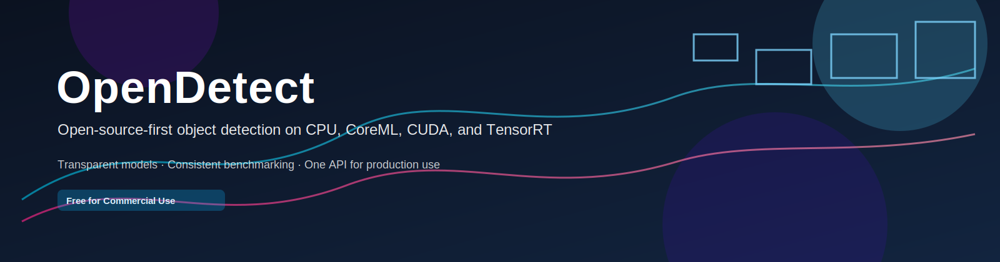

# OpenDetect

[](https://pypi.org/project/opendetect/)
[](https://pypi.org/project/opendetect/)
[](https://opendetect.readthedocs.io/en/latest/)
[](LICENSE)



Open-source object detection for production Python applications.  
Commercial-use friendly. Python API + CLI.

`opendetect` gives you one consistent interface for modern ONNX detectors across CPU and accelerated runtimes.

## Why OpenDetect

- Unified API across detector families
- Runtime-aware acceleration with ONNX Runtime
- Stable OpenCV/NumPy-first workflow for real video/image pipelines
- Built-in model registry, auto-download, and caching
- First-class CLI for inference, benchmarking, and model management

## Install

```bash
pip install opendetect
```

Optional extras:

```bash
pip install "opendetect[cpu]"
pip install "opendetect[gpu]"
pip install "opendetect[tensorrt]"
```

## Quickstart (Python)

```python
import cv2
from opendetect import Detector

detector = Detector(model="rfdetr-m")

image = cv2.imread("input.jpg")
detections = detector.predict(image, color="bgr")
annotated = detector.annotate(image, detections, color="bgr")

cv2.imwrite("output.jpg", annotated)
```

File helpers:

```python
from opendetect import Detector

detector = Detector(model="yolox-s")
detector.infer_image_file("input.jpg", output_path="output.jpg")
detector.infer_video_file("input.mp4", output_path="output.mp4", max_frames=300)
```

## Quickstart (CLI)

```bash
opendetect-infer --image input.jpg --model-id rfdetr-m --output output.png
opendetect-infer --video input.mp4 --model-id yolox-s --tensor-rt --output output.mp4
opendetect-benchmark --model-id rfdetr-l --mode dummy --warmup 20 --iterations 200
opendetect-models list
```

## Runtime Support

OpenDetect uses ONNX Runtime execution providers and selects the best available runtime automatically:

- CPU
- CoreML (Apple Silicon / macOS)
- CUDA
- TensorRT
- DirectML
- OpenVINO
- ROCm / MIGraphX

TensorRT note:

- `opendetect[tensorrt]` installs Python dependencies only.
- A compatible system TensorRT/CUDA stack is still required.

## Model Families

| Family | Year | License posture |
| --- | ---: | --- |
| RF-DETR | 2026 | Open-source, commercial-friendly |
| YOLOX | 2021 | Apache-2.0 |

## Documentation

Hosted docs:

- https://opendetect.readthedocs.io

Full guides are in `docs/`:

- Start here: `docs/index.md`
- Installation and runtimes: `docs/getting-started/installation.md`, `docs/getting-started/runtimes.md`
- Python and CLI usage: `docs/getting-started/python.md`, `docs/getting-started/cli.md`
- Benchmarks: `docs/guides/benchmarks.md`

Build docs locally:

```bash
pip install -r docs/requirements.txt
make -C docs html
```

## License

Apache License 2.0 (`LICENSE`).
